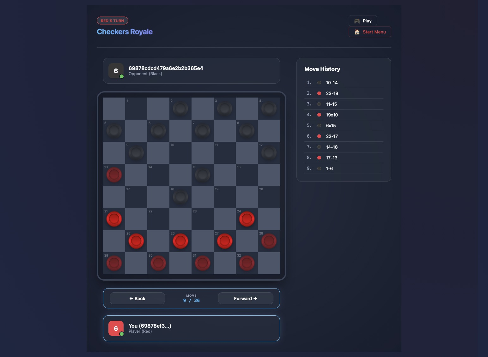

# FastAPI Checkers

A modern, real-time online checkers application built with a focus on Clean Architecture and high-performance communication.



## 🎮 Game Overview

This application implements the classic game of Checkers (English Draughts) with the following features:

- **Pieces**: Each player starts with 12 pieces arranged on the dark squares of the three rows closest to them.
- **Movement**: Pieces move diagonally forward to an adjacent unoccupied dark square.
- **Capturing**: Jumping over an opponent's piece to an empty square beyond it. Capturing is mandatory (standard rules). Multiple captures in a single turn are supported.
- **Kings**: When a piece reaches the farthest row, it becomes a King and gains the ability to move and capture diagonally backwards.
- **Objective**: Win by capturing all of the opponent's pieces or by leaving them with no legal moves.

## 🏗️ Technical Architecture

The project is split into a high-performance backend and a responsive, modern frontend.

### Backend: FastAPI & Python
- **FastAPI**: Provides a robust, asynchronous REST API layer.
- **WebSockets**: State-of-the-record real-time communication for game moves, matchmaking notifications, and status updates.
- **MongoDB**: A document-based database used for persistent game state, player profiles, and the matchmaking queue.
- **Beanie/Pydantic**: ODM and data validation for seamless MongoDB integration.

### Frontend: Angular
- **Reactive State**: RxJS-driven state management for real-time board updates.
- **Modern UI**: A premium, "glassmorphism" aesthetic with smooth animations and responsive layouts.
- **Dynamic Matchmaking**: A dedicated WebSocket service that handles the "Searching for Opponent" flow.

## 🛡️ Clean Architecture Approach

The backend is organized following Clean Architecture principles to ensure maintainability, testability, and separation of concerns:

- **Domain Layer**: Contains the core logic and entities (e.g., `Game`, `Board`, `Player`). This layer has zero dependencies on external frameworks or databases.
- **Application Layer (Handlers/Requests)**: Implements use cases via the **Mediator pattern**. Handlers coordinate the flow of data between the domain and infrastructure (e.g., `JoinQueueHandler`, `MoveHandler`).
- **Infrastructure Layer**: Handles the technical details of persistence and communication.
    - **Repositories**: MongoDB-backed implementations for storing games, players, and matchmaking data.
    - **Connection Manager**: Orchestrates WebSocket lifecycle and message broadcasting.
- **Web Layer (Routers/Dependencies)**: The entry point of the application, defining API endpoints and injecting dependencies.

## 🚀 Getting Started

### Prerequisites
- Python 3.9+
- Node.js & Angular CLI
- MongoDB instance

### Backend Setup
1. Navigate to `CheckersAPI`.
2. Install dependencies: `pip install -r requirements.txt`.
3. Start the server: `uvicorn main:app --host 0.0.0.0 --port 8000`.

### Frontend Setup
1. Navigate to `Angular/checkers-app`.
2. Install dependencies: `npm install`.
3. Start the dev server: `ng serve --host 0.0.0.0 --port 4200 --disable-host-check`.

### Remote Play (ngrok)
To play with friends over the internet, you can use ngrok to tunnel to the Angular dev server:
```bash
ngrok http 4200
```
The application is configured to proxy all API and WebSocket traffic automatically through the Angular host.
